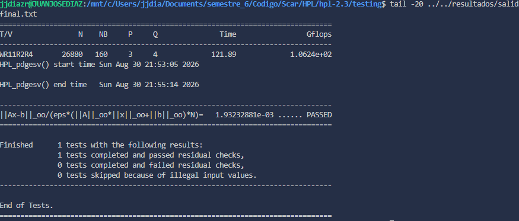

# HPL — High Performance Linpack sobre un portátil

Workshop final del semillero **Scar (HPC)** — EAFIT, 2026-2
Juan José Díaz Rodríguez · 2026-08-30

Medición del rendimiento real (**RMAX**) de una máquina con HPL 2.3, y comparación
contra su rendimiento teórico (**RPEAK**). 

## Resultado

| | |
|---|---|
| **RMAX medido** | **106,24 GFLOPS** |
| RPEAK (frecuencia turbo) | 352 GFLOPS |
| RPEAK (frecuencia base) | 99,2 GFLOPS |
| **Eficiencia (RMAX ÷ RPEAK turbo)** | **30,2 %** |
| Configuración | N = 26.880 · NB = 160 · grilla 3×4 · 12 procesos |
| Tiempo | 121,89 s |
| Validación | `PASSED` — residual 1,93×10⁻³ |



Salida completa en [`resultados/salida_final.txt`](resultados/salida_final.txt),
configuración en [`resultados/HPL.dat.final`](resultados/HPL.dat.final).

## Entorno

**Hardware.** Intel Core i5-1235U (12ª gen, Alder Lake), **arquitectura híbrida**:
2 P-cores (Golden Cove) + 8 E-cores (Gracemont), 12 hilos, TDP 15 W.
Soporta AVX2 y FMA; **no soporta AVX-512** (Intel lo deshabilitó en esta generación
porque los E-cores no lo implementan). 15,6 GiB de RAM, de los cuales WSL2 expone 7 GiB.

**Software.**

| Componente | Versión |
|---|---|
| Sistema | Windows 11 + WSL2 (Ubuntu 24.04) |
| Compilador | gcc 13.3.0 (`Ubuntu 13.3.0-6ubuntu2~24.04.1`), con `-O3 -march=native` |
| Librería matemática | OpenBLAS 0.3.26 (`0.3.26+ds-1ubuntu0.1`) |
| MPI | OpenMPI 4.1.6 |
| Benchmark | HPL 2.3 (netlib, 2 dic. 2018) |

## Reproducir

```bash
# 1. Dependencias
sudo apt update && sudo apt install -y build-essential gfortran \
     libopenmpi-dev openmpi-bin libopenblas-dev

# 2. Fuente de HPL (no versionada en este repo)
wget https://www.netlib.org/benchmark/hpl/hpl-2.3.tar.gz && tar -xzf hpl-2.3.tar.gz

# 3. Compilar
cd hpl-2.3 && ./configure CC=mpicc CFLAGS="-O3 -march=native" LIBS="-lopenblas" && make -j$(nproc)

# 4. Correr
cd testing && cp ../../resultados/HPL.dat.final HPL.dat
export OMP_NUM_THREADS=1 && mpirun --use-hwthread-cpus -np 12 ./xhpl
```

`--use-hwthread-cpus` hace falta porque WSL2 le presenta a Linux una topología
falsa —6 cores con 2 hilos, en vez de los 10 cores físicos reales— y OpenMPI
por defecto cuenta cores, no hilos.

## El problema del RPEAK en una CPU híbrida

La fórmula del curso es `nodos × sockets × cores × frecuencia × FLOP/ciclo`, y
**asume que todos los cores son idénticos**. Este procesador rompe ese supuesto,
así que hay que calcular dos poblaciones y sumarlas.

El `FLOP/ciclo` tampoco es solo el ancho del vector. Son tres factores:
el vector AVX2 de 256 bits carga 4 números de doble precisión (×4), la instrucción
FMA hace multiplicación y suma en una sola operación (×2), y cada core tiene
varias unidades FMA (×2 en los P-cores).

| | Cores | FLOP/ciclo | Base | Turbo |
|---|---|---|---|---|
| P-cores | 2 | 4 × 2 × 2 = 16 | 1,3 GHz | 4,4 GHz |
| E-cores | 8 | 2 × 2 × 2 = 8 | 0,9 GHz | 3,3 GHz |

Los E-cores dan la mitad porque sus unidades FMA son de 128 bits: en un vector
les caben 2 números de doble precisión, no 4.

```
A frecuencia base:   2×16×1,3e9 + 8×8×0,9e9  =  99,2 GFLOPS
A turbo máximo:      2×16×4,4e9 + 8×8×3,3e9  = 352,0 GFLOPS
```

**El RPEAK de esta máquina no es un número, es un rango de 99 a 352 GFLOPS.**
Un nodo de servidor corre a frecuencia fija; un portátil de 15 W acelera cuando
está frío y se frena cuando se calienta. La fórmula pide un dato que esta máquina
no tiene.

### Relación RMAX / RPEAK

La eficiencia es el cociente entre lo medido y el techo teórico,
`eficiencia = RMAX ÷ RPEAK × 100`. Con los dos denominadores posibles:

| Denominador | RPEAK | RMAX ÷ RPEAK |
|---|---|---|
| **Frecuencia turbo** (techo absoluto) | 352,0 GFLOPS | **30,2 %** |
| Frecuencia base | 99,2 GFLOPS | 107,1 % |

```
30,2 %  =  106,24 ÷ 352,0 × 100
107,1 % =  106,24 ÷  99,2 × 100
```

**La cifra que se reporta es 30,2 %**, porque el RPEAK es por definición un techo
que no se puede superar y solo el cálculo a turbo cumple esa condición. El 107 %
no es una eficiencia válida sino la prueba de que el denominador está mal: es
imposible medir por encima del máximo teórico, así que el procesador tuvo que
correr por encima de su frecuencia base (ver conclusión 2).

## Experimentos

### 1. Barrido de NB — el bloque importa un 56%

La documentación de netlib es explícita en que NB no tiene fórmula y hay que
probar. Con N = 10.000 y grilla 3×4:

| NB | 128 | **160** | 192 | 224 | 256 |
|---|---|---|---|---|---|
| GFLOPS | 92,2 | **121,4** | 100,0 | 83,1 | 77,9 |

Hay **56% de diferencia entre el mejor y el peor valor**, con todo lo demás igual.
La curva tiene forma de campana porque los dos extremos fallan por motivos
opuestos: con bloques pequeños hay muchas más rondas de comunicación y
sincronización entre los 12 procesos, y con bloques grandes se desbalancea el
reparto y los bloques dejan de caber cómodos en caché.

### 2. Corrida definitiva — y una anomalía

N se derivó de la memoria disponible. La matriz es N×N de números de 8 bytes,
y se apunta al 80% de la RAM para no empujar al sistema a usar disco:

```
N = √(0,8 × 7 GiB ÷ 8) ≈ 27.415  →  26.880 (múltiplo exacto de 160)
```

| Corrida | N | Duración | GFLOPS |
|---|---|---|---|
| Calibración | 10.000 | 5,5 s | 121,4 |
| **Definitiva** | **26.880** | **121,9 s** | **106,2** |

**La matriz grande rindió un 13% menos que la chica**, con idénticos NB y grilla.
Eso contradice la teoría: al crecer N, HPL hace proporcionalmente más cálculo por
cada ronda de comunicación, y la eficiencia debería subir. La explicación es
**throttling térmico**: la corrida de 5 segundos alcanzó a completarse en turbo;
la de 2 minutos calentó el chip y el procesador bajó la frecuencia para protegerse.

### 3. Reparto MPI vs. OpenMP — Amdahl en acción

Los 12 hilos de la máquina se pueden repartir entre procesos MPI (que se comunican
por mensajes) e hilos de OpenBLAS (que comparten memoria). La hipótesis de partida
era que en una sola máquina la memoria compartida ganaría. **Salió al revés:**

| ranks × hilos | 12 × 1 | 6 × 2 | 4 × 3 | 2 × 6 | 1 × 12 |
|---|---|---|---|---|---|
| P×Q | 3×4 | 2×3 | 2×2 | 1×2 | 1×1 |
| GFLOPS | 116,8 | 119,7 | 91,1 | 68,8 | 51,6 |

De 12 procesos a 1 solo, el rendimiento **cae a menos de la mitad**. La razón es la
ley de Amdahl: HPL no solo multiplica matrices, también factoriza paneles, pivotea
y difunde datos. Con 12 procesos MPI todo el algoritmo está paralelizado; con 1
proceso y 12 hilos, lo único paralelo son las llamadas a `dgemm` de OpenBLAS y
**todo el resto de HPL queda en un solo hilo**. Se le dan hilos a la parte que ya
era rápida y se deja en serie la que no.

Las dos primeras columnas están empatadas dentro del margen de variación entre
corridas (±4%), así que la configuración usada en la medición oficial era la correcta.

## Conclusiones

1. **El RPEAK teórico no aplica limpiamente a hardware híbrido ni a frecuencia
   variable.** La fórmula del curso funciona en un nodo de APOLO y se rompe en un
   portátil, en dos puntos independientes: cores heterogéneos y frecuencia que
   cambia con la temperatura.

2. **El RMAX medido (106 GFLOPS) supera el RPEAK calculado a frecuencia base
   (99 GFLOPS).** Como es imposible pasar el techo teórico, esto demuestra
   experimentalmente que el procesador operó por encima de su frecuencia base,
   y descarta ese denominador. Invirtiendo la cuenta sobre los 96 FLOP/ciclo
   totales, la frecuencia efectiva sostenida rondó los 1,4 GHz.

3. **La eficiencia del 30% es propia del formato, no del algoritmo.** Un clúster
   afinado llega al 70–90%. Los tres culpables aquí son la asimetría P/E —HPL es
   síncrono, y el proceso más lento frena a todos—, el throttling de un chip de
   15 W, y el ancho de banda de memoria compartido entre 12 procesos.

4. **Afinar los parámetros vale más que el hardware.** Elegir mal el NB cuesta un
   56% de rendimiento sobre exactamente la misma máquina.

## Limitaciones

- WSL2 introduce una capa de virtualización y reporta mal la topología de CPU, lo
  que impide fijar procesos a cores concretos (*pinning*) — una técnica que en un
  procesador híbrido probablemente daría bastante.
- El valor de 8 FLOP/ciclo de los E-cores proviene de la documentación de la
  microarquitectura Gracemont y no se verificó de forma independiente.
- No se probaron variantes del parámetro BCAST ni ajustes térmicos; se estimó
  un margen de 2–3%, insuficiente para cambiar ninguna conclusión.

## Estructura

```
├── resultados/
│   ├── HPL.dat.final       # configuración de la corrida oficial
│   ├── salida_final.txt    # salida completa de HPL
│   └── puntaje.png         # captura del resultado en la salida
├── scripts/
│   ├── 00_recon.sh         # reconocimiento de hardware y módulos (pensado para APOLO)
│   └── 01_barrido_hibrido.sh  # barrido MPI × OpenMP del experimento 3
└── .gitignore              # excluye el fuente de HPL y los objetos de compilación
```
